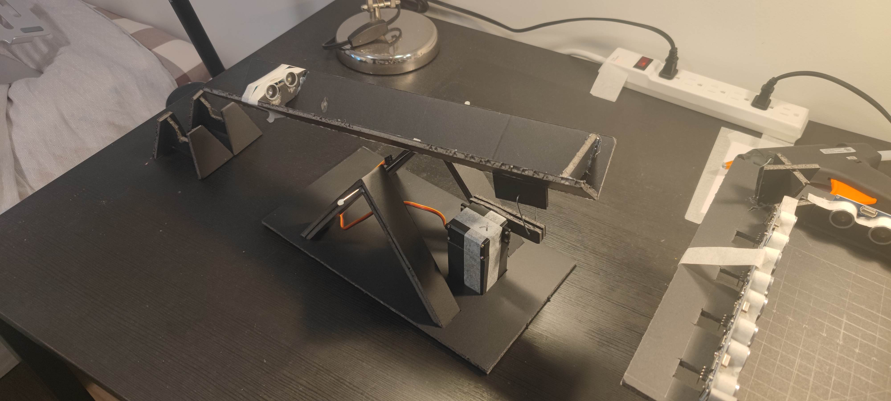
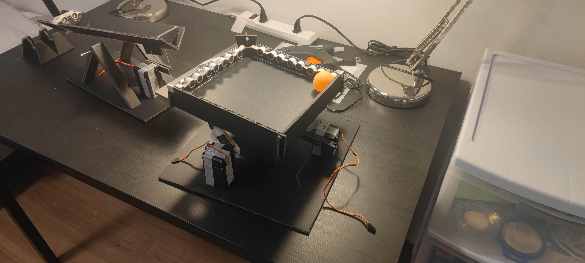

# Working Outcome

Unfortunately, we did not record the real-life performance but only left a few pictures of the system and a testing recording.

## 1D Ball balancing

[Watch Demo Video](000src/outcomes/1.mp4)

## 2D Ball balancing

---
# Project Proposal
## Ball Balancing with PID Control

### Overview

This project aims to balance a ball on a square surface using **PID control** principles. The system will utilize a pressure-sensing plate/screen or a camera to detect the ball’s xy-coordinates on the surface and two servo motors to tilt the surface to prevent the ball from falling. The control system will be implemented using an **STM-32 microcontroller**.

#### Project Stages
1. **1D Ball Balancing:**  
   The ball will be placed on a 1-dimensional (1D) guide rail. Its position will be detected using an **ultrasonic sensor**, and a single servo motor will tilt the rail clockwise or counterclockwise to balance the ball.
2. **2D Ball Balancing:**  
   Expanding on the first stage, a 2D surface will be used to balance the ball, with its position detected by a **camera** or **pressure-sensing screen**.

The final system will demonstrate real-time surface tilting to maintain ball stability during the lab session.

---

### Background

This project is inspired by the following works:

- [1D Ball Balancing by Electronoobs](https://electronoobs.io/tutorial/11#)  
  Infrared sensor, servo motor, and PID control.  
- [2D Ball Balancing by Moosenee](https://www.instructables.com/PID-Controlled-Ball-Balancing-Stewart-Platform/)  
  Touch resistive screen, servo motors, and PID control.  
- [2D Ball Balancing by Giusenso](https://github.com/giusenso/Ball-Balancing-PID-System)  
  Computer vision module, servo motors, and PID control.  

---

### Functionality

The project implements three primary functionalities:

1. **Ball Positioning (BP):**  
   Detecting the ball’s position using either **camera-based positioning (SCCB)** or **force-sensing positioning (USB)**.
2. **Platform Control (PC):**  
   Controlling the 1D/2D platform using **servo motors** with **PWM signals**.
3. **PID Control Algorithm (PID):**  
   Implementing the PID control logic for stable balancing.  

---

### Designer Experience

Relevant courses that provided foundational knowledge:
- **ECE342** and **ECE295:** Serial communication for peripherals and microcontrollers.
- **ECE311** and **ECE470:** PID control methods.

---

### Milestones

- **M1 (Mar 22):** Research, material preparation, 1D hardware setup & testing.  
- **M2 (Mar 29):** Completion of the 1D system, 2D hardware setup & testing.  
- **M3 (Apr 5):** Completion of the 2D system.  

---

### Contingency Plans

Key challenges include:  
- Detecting the ball’s xy-coordinates accurately.  
- Designing a precise mechanical structure for 2D tilting using two servo motors.  

To mitigate risks, the project will start with a **scaled-down 1D version** using an ultrasonic sensor and a single degree of freedom. This simplified approach ensures lower failure risks while building the foundation for the 2D system.

---
